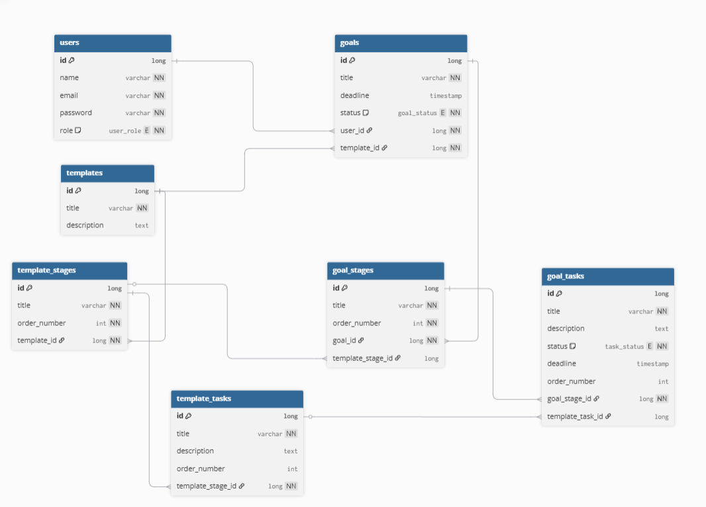

# Aspiro

## Description
Aspiro is a goal-oriented task management system where users choose a predefined template, follow structured stages and tasks, track progress in percentages, and complete goals with deadline support.

## Tech Stack
- Java 21
- Spring Boot
- Gradle

## Run
```bash
gradlew.bat bootRun
```

## Domain Model
The domain model is described in `docs/domain-model.dbml`.
It defines the core entities and relationships used in the system.

### Main Entities
User 
Template 
TemplateStage 
TemplateTask 
Goal 
GoalStage 
GoalTask

### Relationships
A User can have multiple Goals
A Goal is created based on a Template
A Template contains multiple TemplateStages
A TemplateStage contains multiple TemplateTasks
A Goal contains multiple GoalStages
A GoalStage contains multiple GoalTasks

When a user creates a goal from a template, stages and tasks are generated based on the template structure.
Each goal maintains its own independent progress and task states.

### Diagram

